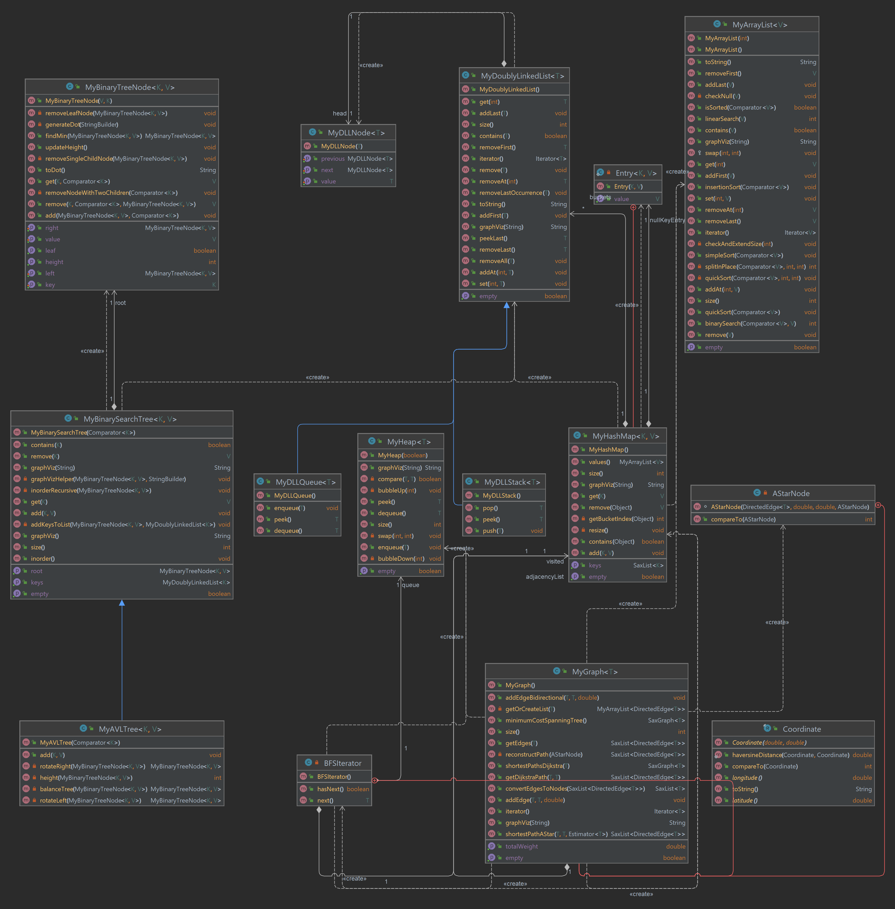

# Algorithms and classes
>In this file I will approach my algorithms and data structures that ware developed for this  project. 
In total, I developed 8 algorithms being A* my favorite and nine data structures being the AVL tree and the Hashmap my favorites.

## My ArrayList
**Classification**: `O(N)` because it has to iterate through the list to find the target value.

### Overview
Since [My ArrayList](../src/nl/saxion/cds/data_structures/list/MyArrayList.java) implementation was the simplest among the data structures, as it is based on a straightforward list structure. While much of the core functionality was given, several methods required additional implementation, such as Linear Search, Binary Search, and QuickSort.

The [My ArrayList](../src/nl/saxion/cds/data_structures/list/MyArrayList.java) is **sortable** and **searchable** being both **sortable** and **searchable**, [My ArrayList](../src/nl/saxion/cds/data_structures/list/MyArrayList.java) works well for general data operations. Plus, it’s a **generic** structure, so it’s flexible for storing any type of data.

- **Tests**: I tested [My ArrayList](../src/nl/saxion/cds/data_structures/list/MyArrayList.java) in [My ArrayList Test](../test/data_structures/lists/MyArrayListTest.java) to make sure everything worked as expected.

 

#### My binary search algorithm
**Classification**: `O(log N)` because it divides the search range in half repeatedly.

**Implementation**:
The binary search algorithm was inspired by the teacher’s pseudocode sheets but implemented in my own way to fit the structure of my list. This method divides the search range in half repeatedly, narrowing down to find the target value efficiently in sorted data.

 

#### My linear search algorithm
**Classification**: `O(N)` because it has to iterate through the list to find the target value.

**Implementation**:
Inspired by the teacher’s examples, I developed my linear search to work effectively within my data structures. This method checks each element one by one, making it straightforward and useful for unsorted lists.

 

#### My QuickSort algorithm
**Classification**: `O(N log N)` because it divides the list into smaller sections and sorts them recursively.

**Implementation**:
For QuickSort, I took inspiration from the provided materials but adjusted it to work with my specific doubly linked list structure. This algorithm uses a pivot to split the list and then recursively sorts each section. It’s optimized for my setup and works well within the structure.

---

## My DoublyLinkedList
**Classification**: `O(N)` because it has to iterate through the list to find the target value.

### Overview
[My DoublyLinkedList](../src/nl/saxion/cds/data_structures/list/MyDoublyLinkedList.java) was another simple structure, so I built this one as well on my own. It’s a generic doubly linked list with nodes defined in my [DoublyLinkedList Node](../src/nl/saxion/cds/data_structures/list/MyDLLNode.java) class.

### Implementation Details
I added some extra methods to make it more versatile:
- **Remove All**: Deletes every node that has a specific value.
- **Remove Last Occurrence**: Deletes only the last node with a given value, which is useful when there are duplicates, but only the most recent one needs to be removed.

These additional methods make [My DoublyLinkedList](../src/nl/saxion/cds/data_structures/list/MyDoublyLinkedList.java) better for cases where I need more control over which nodes are deleted.

- **Tests**: I tested [My DoublyLinkedList](../src/nl/saxion/cds/data_structures/list/MyDoublyLinkedList.java) in [My DoublyLinkedList Test](../test/data_structures/lists/MyDoublyLinkedListTest.java) to make sure everything worked as expected.

---

## My HashMap
**Classification**: `O(1)` because it uses a hash function to find the bucket index quickly.

### Overview
Building [My HashMap](../src/nl/saxion/cds/data_structures/map/MyHashMap.java) was one of my favorite parts of this project! I watched a few YouTube videos to better understand hashmaps and how they work, also I say the class sheets. Two good videos that were especially helpful were:

- [Video 1](https://www.youtube.com/watch?v=H62Jfv1DJlU)
- [Video 2](https://youtu.be/1Ovg3IC-p5A?si=Ik4QdllbVCM6GH-p)

### Why I Liked It
What I love about hashmaps is how fast they can be for looking up values. The key-value pair system makes it possible to access data quickly by using a unique key.

### Implementation Details
In my [My HashMap](../src/nl/saxion/cds/data_structures/map/MyHashMap.java), each bucket uses a **doubly linked list** to handle collisions. Here are a few features:
- **Efficient Lookup**: The hash function calculates the bucket index, so we can look up values quickly.
- **Dynamic Resizing**: If we reach a certain load factor, it resizes to keep operations fast.
- **Exception Handling**: It throws custom exceptions for duplicate keys and missing keys.

Overall, this hashmap combines speed with an easy-to-understand key-value concept, making it a useful and enjoyable structure to implement.

- **Tests**: I tested [My HashMap](../src/nl/saxion/cds/data_structures/map/MyHashMap.java) in [My HashMap Test](../test/data_structures/hashmap/MyHashMapTest.java) to make sure everything worked as expected.

---

## My BS Tree
**Classification**: `O(log N)` because it divides the data at each level to find the target value.

### Overview
[My BS Tree](../src/nl/saxion/cds/data_structures/trees/MyBinarySearchTree.java) is a tree structure that keeps data sorted and allows quick searching. I followed videos and class notes for this, and it mostly worked as expected. The structure helps in quickly finding, adding, or removing items because the tree divides the data at each level.

- [Video 1](https://www.youtube.com/watch?v=Gt2yBZAhsGM)
- [Video 2](https://www.youtube.com/watch?v=mtvbVLK5xDQ)

#### Implementation Details
- **Remove Method**: This includes a remove method to delete items, which I had to make sure didn’t break the tree’s organization I had to remake it a few times to make it work properly and had to debug it with help of Chat GPT.
- **In-Order Traversal**: I added an in-order traversal method to display the tree’s contents in order, which was a fun challenge to implement.

Overall, [My BS Tree](../src/nl/saxion/cds/data_structures/trees/MyBinarySearchTree.java) was a fun challenge to implement, and it’s a useful structure for keeping data sorted and quickly accessible.

- **Tests**: I tested [My BS Tree](../src/nl/saxion/cds/data_structures/trees/MyBinarySearchTree.java) in [My BS Tree Test](../test/data_structures/trees/MyBinarySearchTreeTest.java) to make sure everything worked as expected.

---

## My AVL Tree

**Classification**: `O(log N)` because it balances itself to keep operations fast.

### Overview
[My AVL Tree](../src/nl/saxion/cds/data_structures/trees/MyAVLTree.java) is a balanced binary search tree, meaning it automatically keeps itself organized to ensure fast operations. I found balancing the tree challenging, especially getting the rotations right, which took me about 8 or 9  tries. I used online videos, class sheets, and tips from the teacher to figure it out, but eventually, it all worked.

- [Video 1](https://www.youtube.com/watch?v=jDM6_TnYIqE&t=1960s)
- [Video 2](https://www.youtube.com/watch?v=zP2xbKerIds)
- [Video 3](https://www.youtube.com/watch?v=vRwi_UcZGjU)

#### Implementation Details
- **Balancing**: I added balancing methods to keep the tree in check, which was a fun challenge to get right. 

Overall, [My AVL Tree](../src/nl/saxion/cds/data_structures/trees/MyAVLTree.java) was a challenging, and it’s a useful tool for keeping data organized and quickly accessible.

- **Tests**: I tested [My AVL Tree](../src/nl/saxion/cds/data_structures/trees/MyAVLTree.java) in [My AVL Tree Test](../test/data_structures/trees/MyAVLTreeTest.java) to make sure everything worked as expected.

---

## My MinHeap
**Classification**: `O(log N)` because it keeps the smallest item on top, which requires some shifting.

### Overview
[My MinHeap](../src/nl/saxion/cds/data_structures/heap/MyMinHeap.java) is a data structure that lets me store elements in a way where I can quickly access the smallest (or largest) item, it was made my me with the help od videos and the class sheets. This makes it great for prioritizing tasks or managing data that needs to stay sorted. I made it flexible so that it can act as either a min-heap (smallest item on top) or a max-heap (largest item on top), based on a setting I choose when creating it.

- [Video 1](https://www.youtube.com/watch?v=HqPJF2L5h9U&t)
- [Video 2](https://www.youtube.com/watch?v=WCm3TqScBM8)

#### Implementation Details
- **Keeping Things in Order**: I added helper methods called bubbleUp and bubbleDown. After adding an item, bubbleUp moves it to the right spot if it's out of order. Similarly, when removing the top item, bubbleDown helps shift things around to fill the empty space and keep everything in the right order.
- **Flexible Min or Max Heap:**: To allow both min-heap and max-heap setups, I added a compare method that checks if we’re looking for a smaller or larger value, based on the isMinHeap setting. This way, the code can decide whether to make a min-heap or max-heap without needing separate methods.

Overall, [My MinHeap](../src/nl/saxion/cds/data_structures/heap/MyMinHeap.java) was a fun project that helped me practice sorting data with a heap structure.

- **Tests**: I tested [My MinHeap](../src/nl/saxion/cds/data_structures/heap/MyMinHeap.java) in [My MinHeap Test](../test/data_structures/heap/MyMinHeapTest.java) to make sure everything worked as expected.

---

## My Stack
**Classification**: `O(1)` because it only changes the last element in the list.

### Overview
[My Stack](../src/nl/saxion/cds/data_structures/stack/MyStack.java) is a simple data structure that follows the Last-In-First-Out (LIFO) principle, meaning the most recently added item is the first one removed. This structure is especially useful where you need to track a sequence of operations in reverse order. It was made with the help of the class sheets.

#### Implementation Details
- **Push and Pop**: The push method adds an item to the end of the stack, while pop removes the last item added. Both are quick since they only change the last element in the list.
- **Peek**: The peek method lets us look at the top item without taking it off the stack. This is handy for checking the next item to be removed without changing anything.

Overall, [My Stack](../src/nl/saxion/cds/data_structures/stack/MyStack.java) is a useful LIFO structure that leverages the efficiency of a doubly linked list for stack operations.

- **Tests**: I tested [My Stack](../src/nl/saxion/cds/data_structures/stack/MyStack.java) in [My Stack Test](../test/data_structures/stack/MyStackTest.java) to make sure everything worked as expected.

---

## My Queue
**Classification**: `O(1)` because it only changes the first and last elements in the list.

### Overview
[My Queue](../src/nl/saxion/cds/data_structures/queue/MyQueue.java) is a First-In-First-Out (FIFO) data structure that’s useful for handling items in the order they were added. I implemented it using a doubly linked list for fast access to both ends. I made it with the help of the class sheets.

#### Implementation Details
- **Enqueue and Dequeue**: The enqueue method adds items to the front of the queue, while dequeue removes items from the back. This setup maintains the FIFO order and is quick because it only modifies the ends of the list.

Overall, [My Queue](../src/nl/saxion/cds/data_structures/queue/MyQueue.java) is a useful FIFO structure that leverages the efficiency of a doubly linked list for queue operations.

- **Tests**: I tested [My Queue](../src/nl/saxion/cds/data_structures/queue/MyQueue.java) in [My Queue Test](../test/data_structures/queue/MyQueueTest.java) to make sure everything worked as expected.

---

## My Graph
**Classification**: `O(N)` because it has to explore all nodes and edges to find the target value.

### Overview

[My Graph](../src/nl/saxion/cds/data_structures/graph/MyGraph.java)  represents nodes and edges, where relationships between elements can be explored and visualized. I really enjoyed creating this class and used it for my visual representation project. I used the class sheets and some online sites to help me understand how to implement it.

- [Site 1](https://www.geeksforgeeks.org/implementing-generic-graph-in-java/)
- [Site 2](https://www.baeldung.com/java-graphs)

#### Implementation Details
- **Add Node and Edge**: You can add nodes and edges easily, including directed and bidirectional edges with weights.
- **Breadth-First Search**: This method explores all neighboring nodes step by step, which is helpful for finding the shortest path in simple graphs or navigating networks.
- **Dijkstra’s Algorithm**: This is a way to find the shortest path in a weighted graph, ensuring the path with the lowest cost is found.
- **A*‎ Algorithm**: This is another pathfinding method that uses estimates to help find routes faster, which is great for more complicated graphs.
- **Minimum Spanning Tree**: This connects all nodes in a graph with the least total weight, useful for optimizing connections.

Overall [My Graph](../src/nl/saxion/cds/data_structures/graph/MyGraph.java) combines these features to handle different graph tasks effectively.

- **Tests**: I tested [My Graph](../src/nl/saxion/cds/data_structures/graph/MyGraph.java) in [My Graph Test](../test/data_structures/graph/MyGraphTest.java) to make sure everything worked as expected.

---

### My iterative breadth first search algorithm
Classification: `O(N)` because it has to explore all nodes and edges to find the target value.

### Overview
[My Graph](../src/nl/saxion/cds/data_structures/graph/MyGraph.java) is an implementation of the breadth-first search (BFS) technique for traversing or searching through a graph. BFS explores all neighbor nodes at the present depth prior to moving on to nodes at the next depth level. This method is useful for finding the shortest path in unweighted graphs. I used the class sheets to help me understand and how to implement it.

#### Implementation Details
- **Queue**: I used a queue to keep track of the nodes to visit, ensuring that the algorithm explores all nodes at the current depth before moving on to the next level.
- **Visited Nodes**: I used a hash set to keep track of visited nodes, preventing the algorithm from revisiting nodes and getting stuck in loops.

Overall, [My Graph](../src/nl/saxion/cds/data_structures/graph/MyGraph.java) is a powerful tool for exploring graphs and finding the shortest path in unweighted networks.

- **Tests**: I tested [My Graph](../src/nl/saxion/cds/data_structures/graph/MyGraph.java) in [My Graph Test](../test/data_structures/graph/MyGraphTest.java) to make sure everything worked as expected.

### My Dijkstra algorithm
Classification: `O(N log N)` due to the priority queue.

### Overview
[My Dijkstra](../src/nl/saxion/cds/data_structures/graph/MyGraph.java) is an implementation of the Dijkstra algorithm, which finds the shortest path from a starting node to all other nodes in a weighted graph. This algorithm is efficient and accurate, making it a popular choice for pathfinding tasks. I used the class sheets to help me understand and how to implement it.

- [Video 1](https://www.youtube.com/watch?v=bZkzH5x0SKU)

#### Implementation Details
- **Priority Queue**: I used a priority queue to keep track of the nodes to visit, ensuring that the algorithm explores the nodes with the lowest cost first.
- **Relaxation**: I used a relaxation technique to update the cost of reaching each node, ensuring that the shortest path is found.

- **Tests**: I tested [My Dijkstra](../src/nl/saxion/cds/data_structures/graph/MyGraph.java) in [My Graph Dijkstra Test](../test/data_structures/graph/MyGraphDijkstraTest.java) to make sure everything worked as expected.

### My A* algorithm
Classification: `O(N log N)` due to the priority queue.

### Overview
[My A*](../src/nl/saxion/cds/data_structures/graph/MyGraph.java) implements the A* pathfinding algorithm, which finds the shortest path from a starting node to a target node in a weighted graph. This implementation uses a heuristic to guide the search process, making it efficient. I made it with the help of the class sheets and toke a lot of knowledge from some videos.

- [Video 1](https://www.youtube.com/watch?v=-L-WgKMFuhE)
- [Video 2](https://www.youtube.com/watch?v=i0x5fj4PqP4)
- [Site 1](https://www.geeksforgeeks.org/a-search-algorithm/)

#### Implementation Details
- **Open and Closed Lists**: It uses a priority queue for open nodes and a hash map for closed nodes.
- **Node Processing**: Nodes are evaluated based on the sum of their actual cost from the start node and the estimated cost to the goal. The path is reconstructed once the goal is reached.

Overall, [My A*](../src/nl/saxion/cds/data_structures/graph/MyGraph.java) is a powerful pathfinding algorithm that balances efficiency and accuracy.

- **Tests**: I tested [My A*](../src/nl/saxion/cds/data_structures/graph/MyGraph.java) in [My Graph A* Test](../test/data_structures/graph/MyGraphAstarTest.java) to make sure everything worked as expected.

### My MCST algorithm
Classification: O(N log N)

Implementation: unfortunately I was not able to implement this algorithm fully.

# Technical design My Application
I've designed a simple console menu with six options for the user to explore and analyze a rail network. Here’s a quick rundown of what each option does:

1. **Find Station by Code**
    - Allows the user to enter a station code and get information about that station. This search uses the `MyHashMap` class, where the station code is used as the key.

2. **Search Stations by Name**
    - Lets the user enter a station name or just a few letters to find all matching stations. This is useful if they know part of a station’s name but not the exact name.

3. **List Stations by Type**
    - The user can specify a station type, and this option will list all stations that match that type.

4. **Find Shortest Path Between Two Stations**
    - The user can enter two station names to find the shortest path between them. They also get to choose which algorithm the system should use for finding this path.

5. **Generate Minimum Cost Spanning Tree (MCST)**
    - This option calculates the Minimum Cost Spanning Tree for the rail network, helping the user understand the most efficient way to connect all stations with minimal cost.

6. **View Graph Visualization**
    - After running either the shortest path or MCST options, the user can choose this option to open a graphical visualization of the network.

## Class diagram and reading the data
**Class Diagram**: In this class diagram, the design showcases a comprehensive custom data structure library, covering essential structures like binary search trees, linked lists, heaps, and hash maps, alongside a graph implementation with algorithms for pathfinding. Each class serves a specific role, allowing efficient data management and traversal.

- **MyBinaryTreeNode** and **MyBinarySearchTree** provide the foundation for tree-based data structures.
   - **MyBinaryTreeNode** holds each node’s key, value, and pointers to child nodes, while **MyBinarySearchTree** manages the tree structure, supporting standard binary search tree operations like insertion, deletion, and retrieval.
   - Additionally, **MyAVLTree**, a subclass of **MyBinarySearchTree**, introduces self-balancing capabilities with rotation methods, ensuring that the tree remains balanced for optimal performance.

- **MyArrayList** and **MyDoublyLinkedList** represent list structures.
   - **MyArrayList** is a resizable array that allows for random access and efficient element sorting.
   - **MyDoublyLinkedList** is a linked list that supports bi-directional traversal and insertion at both ends, thanks to its use of **MyDLNode**.

- **MyHeap** and **MyHashMap** add more specialized data structures.
   - **MyHeap** likely serves as a min-heap or max-heap for priority-based operations, ideal for pathfinding algorithms.
   - **MyHashMap**, on the other hand, uses a custom hashing mechanism to store key-value pairs, facilitating fast data retrieval by hash.

- The **MyGraph** class is particularly notable, as it implements a graph structure with support for various algorithms like A* and Dijkstra’s for finding shortest paths.
   - It interacts with **Coordinate** for location-based data (latitude and longitude), likely assisting in distance calculations through the Haversine formula.
   - This class also integrates with custom data structures like **MyHeap** and **MyHashMap** for efficient graph traversal and pathfinding.

- **BFSIterator** represents a breadth-first search iterator, allowing traversal of the graph in a breadth-first manner.
- **AStarNode** encapsulates nodes with heuristic data for the A* algorithm.
- **Coordinate** stores latitude and longitude data for geographical calculations.
- **MyDLLNode** is a node for the doubly linked list, providing pointers to the previous and next nodes.
- **MyHashMapEntry** represents an entry in the hash map, containing a key-value pair.
- **MyHeapNode** is a node for the heap structure, likely holding priority data for heap operations.
- **MyQueue** and **MyStack** are queue and stack structures, respectively, for managing data in a FIFO or LIFO manner.

**Reading the Data**: 
In here after a lof of thinking I decided to approach a method to read my data in this way. Since I used my Stations in several data structures (MyDoubllyLinkList, MyHashMap and MyBinnarrySerachtTree) I decided to create one single method that will read the file only once and give all my stations in the 3 different data structures.
For my tracks data I simply used a method that will read the csv and give me all my station in MyArrayList structure since I only needed that.

# Station search by station code
This option allows users to find a station using its code. I used [My HashMap](../src/nl/saxion/cds/data_structures/map/MyHashMap.java) for quick retrieval.

- **Implementation**: In the `showStationInfoByName` method, the user inputs a station code, and the method retrieves the corresponding [Station](../src/nl/saxion/cds/model/Station.java) object from `stationMap`.
- **Time Complexity**: **O(1)** on average, due to the efficient lookup of the hash map.

- I chose to use a hashmap because it is the most efficient way to search for a station by its code. Since the station code is unique, the hashmap provides a fast way to retrieve the station object.
- I also could have used a binary search tree, but it would have been less efficient for this specific task. The hashmap is the best choice for this scenario.

# Station search based on the beginning of the name
This option lets users search for stations by the beginning of their names. I implemented a linear search using [My ArrayList](../src/nl/saxion/cds/data_structures/list/MyArrayList.java).

- **Implementation**: The `showStationInfoByPartialName` method prompts for a name prefix and iterates through the `stationsList` to find matches, which are collected in `matchingStations`.
- **Time Complexity**: **O(N)**, where **N** is the number of stations, as it checks each station one by one.

- I chose a linear search because the list is unsorted, and a linear search is the simplest way to find matches. It’s not the most efficient, but it works well for this task.
- I could have used a binary search if the list was sorted, but since it’s not, a linear search is the best choice.

- I chose to use HashMap with the name of the station as the key and the station object as the value. This way, I can quickly retrieve the station object by its name.
- I could have also used a hashmap, but it would have required a more complex implementation. The linear search is straightforward and effective for this scenario.

## Implementation shortest route
This option lets my user chose 2 stations and receive the shortest path between then. My user can choose between using A* algorithm and Dijkstra and the user can also visualize it.
The implementation is made using [My Graph](../src/nl/saxion/cds/data_structures/graph/MyGraph.java) populated with my tracks stored in [My ArrayList](../src/nl/saxion/cds/data_structures/list/MyArrayList.java).
The user can choose between A* and Dijkstra algorithm to find the shortest path between the two stations.
Then the user can choose to visualize the path in a graphic representation.

## Implementation minimum cost spanning tree
This option lets my user visualize the minimum cost spanning tree of the rail network. The implementation is made using [My Graph](../src/nl/saxion/cds/data_structures/graph/MyGraph.java) populated with my tracks stored in [My ArrayList](../src/nl/saxion/cds/data_structures/list/MyArrayList.java).
Unfortunately I was not able to implement this option fully.

## Implementation graphic representation(s)
This option lets my user open a Saxion App that will show the graphic representation of the rail network. The implementation is made using [My Graph](../src/nl/saxion/cds/data_structures/graph/MyGraph.java) populated with my tracks stored in [My ArrayList](../src/nl/saxion/cds/data_structures/list/MyArrayList.java).
My user in this small app can see the stations and the tracks between them.
My user can also see the shortest path between two stations and the minimum cost spanning tree.